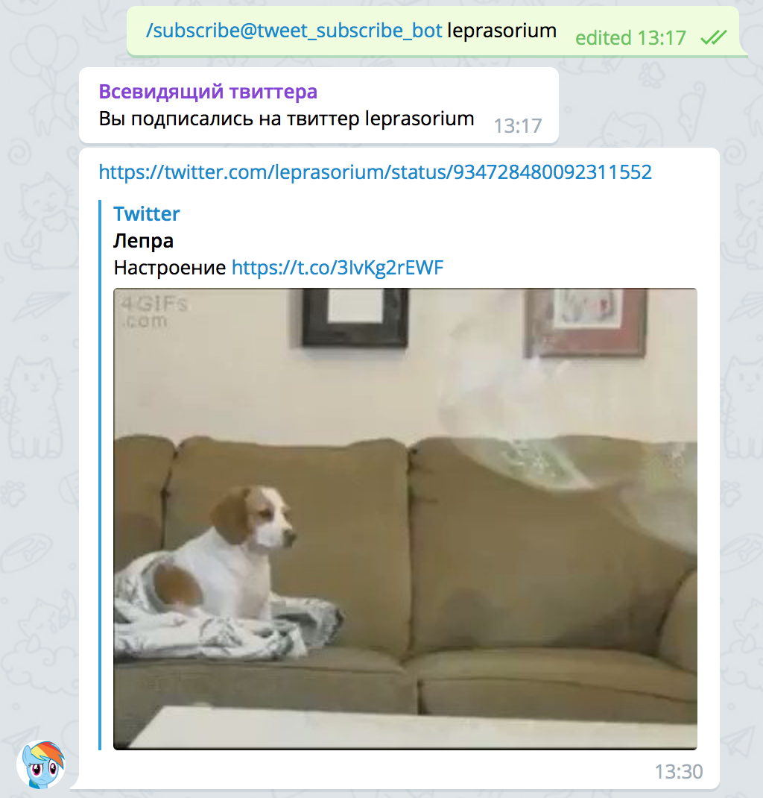

# Twitter Subscribe: TelegramBot

Бот для телеграма, что бы следить за интересующими вас твиттер аккаунтами. Нужно просто указать твиттеры, которые вам интересны, дальше бот по крону раз в 10 минут будет проверять, появилось ли что-то новое и отправлять вам в чат.

  

## Использование бота

Добавьте в чат телеграма ботика `@tweet_subscribe_bot` и он начнёт вам помогать. 

## Команды для работы

- `/subscribe` - Подписаться на твиттер
- `/unsubscribe` - Отписаться от твиттера
- `/gettweets N` - Получить N твиттов
- `/getsubscribers` - Посмотреть список твиттеров, на которые подписаны
